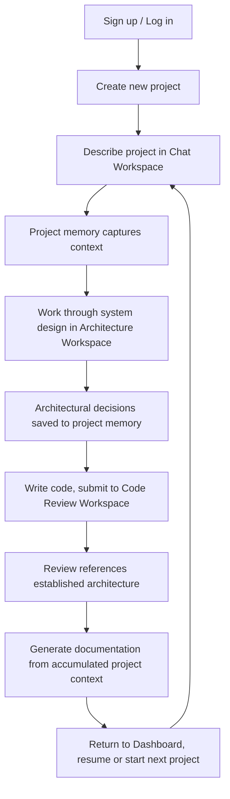

# NexusAI — Product Requirements Document

**Version:** 1.0
**Status:** Draft for Engineering Kickoff
**Owner:** Product/Founding Engineer
**Last Updated:** July 10, 2026
**Document Type:** Internal PRD

---

## Table of Contents

1. [Product Overview](#1-product-overview)
2. [Vision Statement](#2-vision-statement)
3. [Problem Statement](#3-problem-statement)
4. [Market Opportunity](#4-market-opportunity)
5. [Target Audience](#5-target-audience)
6. [User Personas](#6-user-personas)
7. [Goals](#7-goals)
8. [Non-Goals](#8-non-goals)
9. [Product Principles](#9-product-principles)
10. [Core Value Proposition](#10-core-value-proposition)
11. [Core Features](#11-core-features)
12. [MVP Scope (V1)](#12-mvp-scope-v1)
13. [Out-of-Scope Features](#13-out-of-scope-features)
14. [Future Roadmap (V2 and V3)](#14-future-roadmap-v2-and-v3)
15. [User Journey](#15-user-journey)
16. [Functional Requirements](#16-functional-requirements)
17. [Non-Functional Requirements](#17-non-functional-requirements)
18. [Assumptions](#18-assumptions)
19. [Risks](#19-risks)
20. [Success Metrics (KPIs)](#20-success-metrics-kpis)
21. [Release Strategy](#21-release-strategy)

---

## 1. Product Overview

NexusAI is an AI-powered software engineering workspace. It assists developers across the full software development lifecycle — from requirements analysis and architecture design through code review and documentation — by intelligently orchestrating multiple specialized AI models rather than exposing a single general-purpose chatbot.

NexusAI is organized as a set of purpose-built workspaces (chat, architecture, code review, documentation, and others over time), each backed by a persistent project memory that carries context forward so the developer never has to re-explain their project. The product behaves like a structured engineering environment: it applies the right kind of AI reasoning to the right kind of task, at the right stage of a project.

NexusAI is not a code-completion plugin, not a general-purpose assistant, and not a replacement for an IDE. It occupies the layer above implementation: the thinking, planning, structuring, and reviewing work that surrounds writing code.

## 2. Vision Statement

**To become the default engineering workspace where developers plan, design, and review software with AI — the same way an IDE became the default place they write it.**

Long-term, NexusAI aims to be the system of record for how a software project's engineering decisions are made, documented, and revisited — connected directly to where code actually lives, and capable of taking on increasing amounts of well-defined engineering work autonomously, under developer supervision.

## 3. Problem Statement

Developers today use AI throughout the software lifecycle, but they do so by manually stitching together multiple disconnected tools:

- A general chatbot for early requirements discussion and architecture brainstorming.
- A separate tool for research and technical due diligence.
- An IDE-embedded assistant for inline code completion.
- The same or another chatbot, in a new thread, for code review — usually by pasting code with no awareness of the broader project.
- Manual effort, or yet another tool, to turn all of the above into documentation.

This fragmentation creates three concrete problems:

1. **Context loss.** Every new tool, and often every new conversation, starts from zero. The developer re-explains the project, its constraints, and prior decisions repeatedly. Nothing accumulates.
2. **Mismatched reasoning.** A single general-purpose model is asked to do fundamentally different jobs — creative brainstorming, structured design, precise critique, factual documentation — with no adaptation to the kind of thinking each job actually requires. Quality is inconsistent because the tool doesn't change its approach to match the task.
3. **No engineering discipline.** Chat interfaces are freeform. They don't guide a developer through the sequence a real engineering process follows (requirements → design → review → documentation). Important steps get skipped not because the developer doesn't value them, but because nothing in the tool prompts for them.

The result: AI genuinely helps developers write code faster, but does comparatively little to help them think better about the system they're building, or to leave behind a coherent trail of why it was built that way.

## 4. Market Opportunity

AI-assisted software development has moved from novelty to default expectation in under three years. Two categories currently dominate developer attention:

- **Inline code-completion tools**, embedded in the editor, optimized for the moment of writing a line or function of code.
- **General-purpose AI chat assistants**, used ad hoc for everything from debugging to architecture discussion to writing documentation, with no persistent structure around the project itself.

Both categories are mature and well-funded, but neither directly targets the layer NexusAI occupies: a structured, persistent, multi-model workspace for the engineering *thinking* that surrounds code — requirements, architecture, database and API design, review, and documentation — unified by a memory of the project itself.

This gap matters because the highest-leverage engineering decisions (what to build, how to structure it, whether a design will hold up) happen before and around the code, not inside a single function. As AI capability commoditizes at the code-completion layer, the differentiated value shifts upward, toward tools that help developers reason about systems, not just produce syntax. NexusAI is positioned to capture that shift early, starting with individual developers and students, and expanding toward small engineering teams who need consistent design and review standards without a dedicated architect on staff.

## 5. Target Audience

**Primary (V1):**
- Software engineering students and early-career developers building real projects and wanting structured, mentor-like engineering guidance.
- Independent developers and solo founders building products without a team of specialists (architects, reviewers, technical writers) around them.

**Secondary (future versions):**
- Small engineering teams (roughly 3–15 engineers) who want consistent architectural and review standards without hiring dedicated senior staff for every project.
- Bootcamp and university programs looking for a structured tool to teach real-world engineering process, not just syntax.

NexusAI is not initially targeting large enterprises, regulated industries, or teams requiring deep custom compliance tooling. Those needs are explicitly deferred (see Section 8, Non-Goals, and Section 14, Roadmap).

## 6. User Personas

### Persona 1 — Priya, Final-Year CS Student
- **Context:** Building portfolio projects to stand out in a competitive junior developer job market. Comfortable writing code but has limited exposure to real-world engineering process — she's never worked with a technical architect or gone through a formal code review cycle.
- **Goals:** Learn to think and build like a professional engineer, not just produce working code. Wants her portfolio projects to reflect real engineering discipline (architecture decisions, structured reviews, documentation) that she can discuss confidently in interviews.
- **Frustrations:** General chatbots give inconsistent, un-structured advice that varies by how the question is phrased. She doesn't know what a "good" architecture decision record or a "good" code review even looks like, so she can't self-evaluate.
- **How NexusAI helps:** Structured workspaces model what professional engineering process looks like, at each stage, with reasoning she can learn from — not just answers.

### Persona 2 — Marcus, Independent Developer / Solo Founder
- **Context:** Building a product on his own, wearing every engineering role at once — architect, backend engineer, reviewer, technical writer. Time is his scarcest resource.
- **Goals:** Move fast without accumulating the kind of technical debt that stalls a solo project six months in. Wants a second opinion on design decisions and code quality without hiring a contractor or waiting on a friend.
- **Frustrations:** Switching between multiple AI tools and re-explaining his project every time is a constant tax. He often skips architecture planning and documentation entirely under time pressure, and pays for it later.
- **How NexusAI helps:** One workspace that remembers his project, so every interaction builds on the last, and structured workspaces that make good practice the path of least resistance rather than extra work.

### Persona 3 — Elena, Engineering Lead at a Small Startup *(secondary, informs future roadmap)*
- **Context:** Leads a small team of 4 engineers at an early-stage startup. No dedicated architect; design and review quality depends heavily on who happens to be available.
- **Goals:** Consistent architectural standards and review quality across the team, without slowing the team down or hiring a senior architect she can't yet afford.
- **Frustrations:** Design decisions live in Slack threads and people's heads. Review quality varies by reviewer. Nothing captures *why* a decision was made for the next engineer who has to work around it.
- **How NexusAI helps (future):** A shared workspace and project memory the whole team draws from, so standards and rationale persist beyond any one person's memory. This persona is out of scope for V1 (which is single-user) but directly shapes the V2 collaboration roadmap.

## 7. Goals

**Product goals:**
- Give developers a single workspace that carries project context across the requirements → architecture → review → documentation lifecycle, so context never has to be re-established.
- Demonstrate that task-appropriate AI orchestration produces meaningfully better engineering output than a single general-purpose chat interface.
- Establish a modular product foundation that can grow from a single-user tool into a collaborative, integration-connected platform without a rebuild.

**MVP-specific goals:**
- Ship a working, deployable, end-to-end product within approximately one month that credibly demonstrates the core differentiator: intelligent multi-model orchestration across distinct engineering workspaces backed by persistent project memory.
- Produce a product of sufficient quality and completeness to serve as the centerpiece of a professional software engineering portfolio.

## 8. Non-Goals

To keep V1 achievable and focused, NexusAI explicitly does **not**, in this version:
- Replace an IDE or code editor.
- Provide autonomous, unsupervised code-writing or code-committing agents.
- Integrate with source control platforms (e.g., pull request review, repository import).
- Support multi-user collaboration on a shared project.
- Support team administration, roles, or permissions.
- Support self-hosted or locally-run AI models.
- Offer a plugin or extension ecosystem.
- Target enterprise compliance, audit, or procurement requirements.
- Attempt to be a general-purpose chatbot for non-engineering tasks.

These are deliberate deferrals, not oversights — each is addressed in the future roadmap once the core single-user experience is validated.

## 9. Product Principles

1. **A workspace, not a chat window.** Every interaction happens inside a purpose-built module suited to the task, not a single undifferentiated thread.
2. **Context is a first-class citizen.** The project's memory persists across every workspace and every session. Nothing should ever need to be re-explained.
3. **The right reasoning for the right task.** Different engineering tasks require different kinds of AI reasoning. NexusAI's job is to route each task to the model best suited to it, and to make that routing invisible in its simplicity but visible in its transparency.
4. **Transparency over magic.** When NexusAI makes a decision — which model handled a task, what context it used — the developer can see it. Trust is built through visibility, not opacity.
5. **Structure guides, it doesn't cage.** Workspaces impose enough structure to encourage good engineering practice, without forcing rigid workflows the developer can't deviate from.
6. **Quality over feature count.** Every workspace shipped should be complete and reliable rather than adding breadth that dilutes depth.
7. **Explainability by default.** Especially in V1, output should help the developer understand *why*, not just *what* — reinforcing engineering judgment, not replacing it.

## 10. Core Value Proposition

**NexusAI turns AI from a tool developers occasionally consult into an engineering workspace they build inside — one that remembers their project, applies the right kind of reasoning to each stage of development, and leaves behind a coherent record of how the system was designed and why.**

Supporting pillars:
- **Unified, not fragmented.** One workspace replaces the manual juggling of multiple disconnected AI tools across the development lifecycle.
- **Persistent, not stateless.** Project memory accumulates across sessions and workspaces, so every interaction is informed by everything that came before it.
- **Specialized, not generic.** Requests are matched to the model best suited to the task, instead of forcing one general-purpose model to do every job equally.
- **Structured, not freeform.** Purpose-built workspaces model professional engineering process at each stage of the lifecycle.

## 11. Core Features

The table below describes NexusAI's full intended capability set across the software development lifecycle. Not all of these ship in V1 — Section 12 defines exact MVP scope, and Section 14 defines when the remainder arrives.

| Feature Area | Description |
|---|---|
| **Requirements Analysis** | Structured elicitation and clarification of what a project needs to do, producing organized, revisitable requirements rather than a scattered chat transcript. |
| **Software Architecture Design** | Guided reasoning through system structure, component boundaries, and key architectural trade-offs, producing artifacts the developer can reference going forward. |
| **Database Design** | Structured reasoning through data modeling decisions — entities, relationships, and design trade-offs — appropriate to the project's requirements. |
| **API Design** | Structured reasoning through API surface design and contract decisions, consistent with the project's architecture. |
| **Code Generation** | AI-assisted generation of code aligned to the project's established architecture and conventions. |
| **Code Review** | Structured, critical review of submitted code against correctness, quality, and design-consistency criteria, with reasoning attached to each finding. |
| **Debugging** | Guided root-cause analysis of reported bugs or unexpected behavior, informed by project context. |
| **Documentation Generation** | Generation of coherent, human-readable documentation from the project's accumulated context and artifacts. |
| **Test Generation** | AI-assisted generation of test cases aligned to the project's requirements and code. |
| **Deployment Guidance** | Structured guidance through deployment readiness and rollout considerations. |

**The differentiator underlying all of the above is not any single feature — it's the orchestration and memory layer that connects them.** Multi-model orchestration ensures each capability is handled by AI reasoning suited to that specific task type. Project memory ensures every capability draws on the same accumulated understanding of the project, so a review references the same architecture the developer designed two weeks earlier without being re-told about it.

## 12. MVP Scope (V1)

V1 is scoped to prove the core differentiator — orchestration plus persistent memory — end-to-end, through a focused subset of the full capability set, achievable by a single developer in approximately one month.

| # | Feature | Included in V1 |
|---|---|---|
| 1 | **Authentication & Account Management** | Yes — single-user account creation, login, and session management. |
| 2 | **Project Dashboard** | Yes — create, view, switch between, and manage individual projects. |
| 3 | **AI Chat Workspace** | Yes — the general-purpose entry point for open-ended engineering conversation (requirements discussion, debugging help, ad hoc questions), scoped to the active project's context. |
| 4 | **Multi-Model Orchestration Engine** | Yes — the core differentiator. Classifies incoming requests by task type and routes each to the AI model best suited to it, across all workspaces. |
| 5 | **Project Memory / Context System** | Yes — persistent, per-project context that accumulates across sessions and is available to every workspace. |
| 6 | **Architecture Workspace** | Yes — structured workflow for reasoning through system architecture, including database and API design decisions as part of the project's architectural artifacts. |
| 7 | **Code Review Workspace** | Yes — structured workflow for submitting code and receiving critical, project-aware review. |
| 8 | **Documentation Generator** | Yes — generates project documentation from accumulated context and artifacts produced in other workspaces. |

**Definition of MVP done:** a developer can create a project, describe it in the chat workspace, work through its architecture (including data and API design decisions) in the architecture workspace, submit code for review with the system aware of the architecture it was reviewed against, and generate documentation that reflects the project accurately — all without ever re-explaining the project, and with visible evidence that different requests were handled by reasoning suited to that request.

## 13. Out-of-Scope Features

Explicitly excluded from V1 (see Section 14 for when, if ever, each is planned):

- Dedicated Debugging workspace (debugging support exists only informally, within the general Chat Workspace, in V1).
- Dedicated Test Generation workspace.
- Dedicated Deployment Guidance workspace.
- Standalone Code Generation / scaffolding tooling beyond what naturally surfaces in chat and review.
- Source control integration of any kind (repository import, pull request review, commit awareness).
- Autonomous or unsupervised agents that take multi-step action without developer confirmation at each step.
- Multi-user projects, team roles, or any collaboration features.
- Plugin ecosystem or third-party extensions.
- Local or self-hosted model support.
- Enterprise features: SSO, audit logging, compliance certifications, usage-based billing administration.
- Mobile applications.

## 14. Future Roadmap (V2 and V3)

### V2 — Depth and Connection
Focus: deepen the individual lifecycle stages and connect NexusAI to where developers already work.
- **GitHub integration:** import existing repositories to seed project memory; review pull requests directly instead of pasted code.
- **Dedicated Debugging Workspace:** structured root-cause analysis workflow, separated from general chat.
- **Dedicated Test Generation Workspace.**
- **Dedicated Deployment Guidance Workspace.**
- **Richer Architecture Workspace:** dedicated database design and API design sub-workflows with their own structured artifacts, rather than being folded into general architecture output.
- **Team Collaboration (early):** shared projects for small teams, with a single shared project memory.
- **Advanced project observability:** dashboards showing project health, decision history, and review trends over time.

### V3 — Autonomy and Ecosystem
Focus: extend NexusAI from an assistant developers actively direct to a platform that can take on well-defined work under supervision, and open it to extension.
- **Autonomous agents:** capable of executing well-scoped, multi-step engineering tasks (e.g., implementing a reviewed and approved design) with developer checkpoints, not unsupervised commits.
- **Pull request review automation:** automatic, project-aware review triggered by repository activity.
- **Plugin ecosystem:** third-party extensions and integrations built on NexusAI's orchestration and memory layer.
- **Local / self-hosted model support:** for teams with data residency or cost requirements.
- **Marketplace:** community- or third-party-contributed workflows, review rules, and architectural templates.
- **Enterprise readiness:** SSO, audit logs, granular permissions, and compliance support for larger organizations.

## 15. User Journey

The primary V1 journey, illustrated through Priya (Persona 1):

**Narrative walkthrough:**
1. Priya signs up and lands on an empty Project Dashboard. She creates a new project and gives it a name and a short description.
2. She opens the Chat Workspace and talks through what she's building — a task-management API. Nothing here is formally structured yet; it's a conversation. NexusAI captures the meaningful context (goals, constraints, key decisions already made) into the project's memory automatically.
3. She moves to the Architecture Workspace. It already knows what she described in chat — she isn't asked to repeat herself. She works through the system's structure, including key data and API design decisions, and NexusAI's reasoning is visibly suited to structured design thinking rather than casual conversation.
4. A week later, she writes an initial implementation and submits a file to the Code Review Workspace. The review references the architecture she designed the week before, without her needing to paste it in again or remind the system what she'd decided.
5. Once she's happy with the state of the project, she generates documentation. It reflects the actual decisions made across chat and architecture, not a generic template.
6. She returns to the Dashboard, where her project — and everything NexusAI has learned about it — is waiting exactly as she left it.

## 16. Functional Requirements

Requirements are grouped by feature area and numbered for traceability. Each is written to be independently testable.

### 16.1 Authentication & Account Management (FR-AUTH)
| ID | Requirement |
|---|---|
| FR-AUTH-01 | A new user must be able to create an account using an email address and password. |
| FR-AUTH-02 | An existing user must be able to log in and log out. |
| FR-AUTH-03 | The system must persist a user's session so they are not required to log in on every visit within a defined session window. |
| FR-AUTH-04 | A user must be able to reset a forgotten password. |
| FR-AUTH-05 | A user must be able to view and update basic account details (name, email). |
| FR-AUTH-06 | A user must be able to permanently delete their account and associated data. |

### 16.2 Project Dashboard (FR-DASH)
| ID | Requirement |
|---|---|
| FR-DASH-01 | A user must be able to create a new project with a name and description. |
| FR-DASH-02 | A user must be able to view a list of all their projects. |
| FR-DASH-03 | A user must be able to open a project and land in its default workspace. |
| FR-DASH-04 | A user must be able to rename, edit the description of, or delete a project. |
| FR-DASH-05 | Each project listing must indicate recent activity (e.g., last updated) so a user can identify where they left off. |

### 16.3 AI Chat Workspace (FR-CHAT)
| ID | Requirement |
|---|---|
| FR-CHAT-01 | A user must be able to send free-form messages within the context of a specific project. |
| FR-CHAT-02 | Every message sent in the Chat Workspace must have access to that project's accumulated memory. |
| FR-CHAT-03 | Meaningful information shared in chat (goals, constraints, decisions) must be eligible for capture into project memory. |
| FR-CHAT-04 | A user must be able to view the full history of a project's chat conversation. |
| FR-CHAT-05 | A user must be able to start a new conversation thread within the same project without losing prior project memory. |

### 16.4 Multi-Model Orchestration Engine (FR-ORCH)
| ID | Requirement |
|---|---|
| FR-ORCH-01 | Every incoming request must be classified by task type (e.g., conversational, architectural reasoning, critical review, documentation generation) before being handled. |
| FR-ORCH-02 | Each classified request must be routed to the model or reasoning approach designated as best suited to that task type. |
| FR-ORCH-03 | The system must indicate to the user, in a visible and understandable way, what kind of reasoning handled their request. |
| FR-ORCH-04 | If a preferred model or reasoning path is unavailable, the system must fail over to a defined fallback rather than returning an error to the user. |
| FR-ORCH-05 | Orchestration decisions must be logged for later review and improvement of the routing logic. |

### 16.5 Project Memory / Context System (FR-MEM)
| ID | Requirement |
|---|---|
| FR-MEM-01 | Each project must maintain a persistent memory distinct from any other project. |
| FR-MEM-02 | Project memory must be accessible to every workspace (Chat, Architecture, Code Review, Documentation) within that project. |
| FR-MEM-03 | A user must be able to view a summary of what NexusAI currently "knows" about their project. |
| FR-MEM-04 | A user must be able to manually correct or remove specific items from project memory. |
| FR-MEM-05 | Project memory must update as new decisions and artifacts are produced in any workspace. |

### 16.6 Architecture Workspace (FR-ARCH)
| ID | Requirement |
|---|---|
| FR-ARCH-01 | A user must be able to initiate a structured architecture design session for their project. |
| FR-ARCH-02 | The workspace must incorporate existing project memory (e.g., requirements discussed in chat) without requiring re-entry. |
| FR-ARCH-03 | The workspace must support reasoning through key architectural decisions, including data modeling and API design considerations, as part of a single coherent design process. |
| FR-ARCH-04 | Architectural decisions produced in this workspace must be saved as a distinct, retrievable artifact within the project. |
| FR-ARCH-05 | A user must be able to revisit and view previously produced architecture artifacts for a project. |

### 16.7 Code Review Workspace (FR-REV)
| ID | Requirement |
|---|---|
| FR-REV-01 | A user must be able to submit code (via paste or file upload) for review within a project. |
| FR-REV-02 | Review output must reference relevant project context, including prior architecture decisions, where applicable. |
| FR-REV-03 | Review output must be structured (e.g., organized by finding, with a stated rationale per finding), not a single unstructured block of prose. |
| FR-REV-04 | A user must be able to view the history of past reviews for a project. |
| FR-REV-05 | Review findings must be distinguishable by severity or category (e.g., correctness vs. style vs. design consistency). |

### 16.8 Documentation Generator (FR-DOC)
| ID | Requirement |
|---|---|
| FR-DOC-01 | A user must be able to trigger documentation generation for their project. |
| FR-DOC-02 | Generated documentation must draw on accumulated project memory and artifacts (chat context, architecture decisions) rather than generic boilerplate. |
| FR-DOC-03 | A user must be able to view and export generated documentation. |
| FR-DOC-04 | A user must be able to regenerate documentation after the project has changed, reflecting the updated state. |

## 17. Non-Functional Requirements

| Category | Requirement |
|---|---|
| **Performance** | Interactive workspaces (Chat, Architecture, Code Review) must acknowledge a user's request and begin producing visible output within a short, consistent time frame, so the product feels responsive rather than batch-processed. |
| **Reliability** | Core workspace functionality must degrade gracefully — if a specific AI model or reasoning path is unavailable, the system must inform the user or fail over, rather than silently failing or hanging indefinitely. |
| **Security** | User data, project content, and account credentials must be protected consistent with standard practices for handling personal and proprietary information. Authentication must follow secure, industry-standard practices. |
| **Privacy** | A user's project content and memory must not be accessible to any other user. Users must be able to delete their data. |
| **Usability** | A first-time user must be able to understand what each workspace is for and complete a first meaningful action (e.g., first chat message, first review) without external instructions. |
| **Consistency** | The system's behavior, tone, and structure must be predictable across workspaces — a user should be able to infer how a new workspace works based on their experience with existing ones. |
| **Maintainability** | The product must be built on a modular foundation such that individual workspaces or the orchestration layer can be extended or replaced independently, without requiring a full product rebuild. |
| **Scalability path** | While V1 is single-user, the underlying product structure must not preclude the multi-user, collaborative features planned for V2 — this must be considered in design, not bolted on retroactively. |
| **Observability** | The system must retain enough operational visibility (e.g., logs of orchestration decisions, errors, and usage) to diagnose issues and evaluate whether routing decisions are producing good outcomes. |
| **Auditability of AI output** | Every AI-generated output within a workspace must be traceable to which reasoning path produced it, supporting the transparency principle in Section 9. |

## 18. Assumptions

- Reliable, ongoing access to third-party AI model providers (via API) is available throughout development and operation, at a cost sustainable for a single-developer, pre-revenue product.
- V1 users are individual developers working alone on a single device at a time; concurrent multi-device or multi-user editing of the same project is not required.
- Users are willing to have their project-related communication (chat messages, submitted code) processed by third-party AI providers in order to receive assistance; this is disclosed to the user.
- A one-month timeline is sufficient for a single developer to deliver the MVP scope defined in Section 12, given the deliberate exclusions in Section 13.
- The primary evaluation audience for the MVP (recruiters, technical interviewers, early users) values demonstrated engineering judgment and structured process at least as much as raw feature breadth.
- Task classification for orchestration (Section 16.4) can be handled with acceptable accuracy without requiring the user to manually specify which workspace or model should handle a given request.

## 19. Risks

| Risk | Impact | Mitigation |
|---|---|---|
| **Single-developer bandwidth.** All design, build, and QA responsibility sits with one person against a one-month timeline. | High — scope slip directly threatens MVP delivery. | MVP scope (Section 12) is deliberately narrow and every exclusion in Section 13 is explicit and pre-agreed, not discovered mid-build. |
| **AI output quality and reliability.** Architecture and review guidance that is subtly wrong could mislead a developer, especially a student who may not be positioned to catch the error. | Medium-High — undermines trust, the product's core value proposition. | Transparency principle (Section 9) — reasoning is shown, not just conclusions, so users can evaluate output critically rather than accept it blindly. Review and documentation outputs are framed as structured assistance, not infallible authority. |
| **Third-party AI provider dependency.** Cost, rate limits, or availability changes from external model providers directly affect the product's core functionality. | Medium — could degrade service or unexpectedly increase operating cost. | Orchestration engine includes defined fallback behavior (FR-ORCH-04); usage is monitored via observability requirements (Section 17). |
| **Differentiation risk.** Incumbent code-completion tools and general chat assistants are well-resourced and could extend into structured, project-aware workflows. | Medium — could erode the product's positioning over time. | V1 focuses on proving the orchestration-plus-memory differentiator concretely rather than competing on feature breadth; roadmap (Section 14) prioritizes deepening this differentiator before chasing parity elsewhere. |
| **Scope creep from an ambitious long-term vision.** The full lifecycle vision (Section 11) is broad; there is a constant temptation to pull V2/V3 features into V1. | Medium — directly threatens the one-month timeline. | Sections 12 and 13 exist specifically to make in-scope and out-of-scope explicit and to be referenced whenever a scope question arises during build. |
| **Project memory quality.** If the system captures the wrong context, or fails to capture the right context, every downstream workspace's output degrades. | Medium — undermines the product's central premise. | User-facing memory review and correction (FR-MEM-03, FR-MEM-04) gives users a way to catch and fix bad context before it compounds. |

## 20. Success Metrics (KPIs)

**Product/portfolio-context metrics (primary for V1):**
- MVP is fully deployed, publicly accessible, and demonstrable end-to-end without manual intervention.
- All V1 functional requirements (Section 16) are implemented and pass defined acceptance criteria.
- A complete example project can be walked through the full V1 journey (Section 15) start to finish, producing coherent, project-consistent output at every stage.
- Documentation set (PRD, architecture decisions, API references, deployment guide) is complete and accurate as of launch.

**Engagement metrics (early usage validation):**
- **Activation rate:** percentage of signed-up users who create a project and send at least one message in the Chat Workspace.
- **Workspace adoption:** percentage of active projects that use at least three of the four core V1 workspaces (Chat, Architecture, Code Review, Documentation), indicating the product is being used as an integrated workspace rather than a single-feature tool.
- **Memory utilization:** frequency with which outputs in Architecture, Code Review, or Documentation workspaces visibly draw on context established elsewhere in the project — a proxy for whether the core differentiator is actually being felt.
- **Retention:** percentage of users who return to an existing project in a second session within a defined window.

**Quality metrics:**
- **Perceived usefulness** of orchestration transparency (Section 9, Principle 4) and structured review/architecture output, gathered through direct user feedback given the small early user base.
- **Failure/fallback rate** of the orchestration engine (Section 16.4), tracked as an operational health signal.

## 21. Release Strategy

Given the one-month, single-developer timeline, release is staged by scope rather than by user rollout percentage:

**Phase 0 — Foundation (Week 1)**
Deliver Authentication and the Project Dashboard. A user can sign up, log in, and create/manage projects. No AI-powered workspace is live yet; this phase establishes the shell the rest of the product lives in.

**Phase 1 — Core Loop (Week 2)**
Deliver the AI Chat Workspace, the Multi-Model Orchestration Engine, and the Project Memory system. At the end of this phase, the core differentiator — context-aware, orchestrated AI assistance — is demonstrable, even before the specialized workspaces exist.

**Phase 2 — Specialized Workspaces (Week 3)**
Deliver the Architecture Workspace and the Code Review Workspace, both drawing on the memory system delivered in Phase 1. This phase proves that orchestration and memory generalize across genuinely different task types, not just chat.

**Phase 3 — Closing the Loop & Hardening (Week 4)**
Deliver the Documentation Generator, which depends on artifacts from every prior phase. Remainder of the phase is dedicated to end-to-end testing against the full user journey (Section 15), security review, performance validation against Section 17's non-functional requirements, and finalizing documentation.

**Launch:**
- **Internal alpha:** continuous self-use (dogfooding) throughout all four phases — every workspace is validated against a real project as it's built.
- **Closed beta:** a small group of early users (fellow students, developers) exercise the full V1 journey shortly before public release and surface issues Phase 3 testing may have missed.
- **Public MVP launch:** product is made publicly accessible, positioned as a portfolio centerpiece, at the close of the one-month window.

Post-launch, roadmap prioritization (Section 14) is revisited based on actual usage against the Section 20 metrics, rather than being fixed in advance.

---

*End of document.*