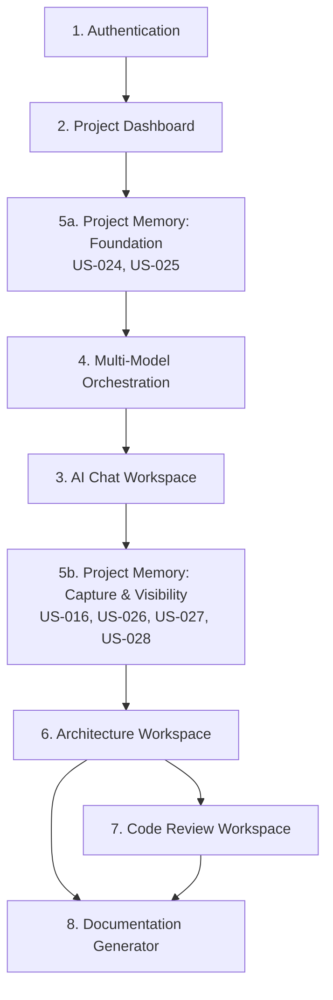

# NexusAI — MVP User Stories & Implementation Backlog

**Version:** 1.0
**Status:** Ready for Engineering Handoff
**Source Document:** NexusAI PRD v1.0
**Owner:** Product/Founding Engineer
**Last Updated:** July 10, 2026

---

## How to Read This Document

Every story in this backlog is derived directly from a Functional Requirement (FR) in the NexusAI PRD — no new features have been introduced. Where a single FR describes two distinct user actions (e.g., "log in and log out"), it has been split into two stories so each is independently implementable and testable. This is noted explicitly in each story's **Notes** field.

Each story includes:
- **Story ID** — unique identifier (US-001, US-002…)
- **Epic** — the module-level epic it belongs to
- **User Story** — As a / I want / So that
- **Acceptance Criteria** — Given / When / Then
- **Priority** — Must Have / Should Have / Could Have, scoped to the one-month MVP
- **Dependencies** — other Story IDs that must exist first
- **Notes** — FR traceability and any relevant context

Sections after the backlog cover completeness review, deduplication, full FR traceability, a story dependency map, and a four-week sprint plan.

---

## 1. Authentication
*Epic: User Authentication & Account Management*

---
**US-001 — Account Sign-Up**
**User Story:** As a new user, I want to create an account using my email address and a password, so that I can access NexusAI and have my projects saved under my own identity.
**Acceptance Criteria:**
- Given I am on the sign-up page and have no existing account, when I submit a valid email and password, then a new account is created and I am signed in.
- Given I try to sign up with an email already in use, when I submit the form, then I receive a clear error and no duplicate account is created.
- Given I submit a password that fails minimum security requirements, when I attempt to sign up, then I see a validation error and no account is created.
**Priority:** Must Have
**Dependencies:** None
**Notes:** Maps to FR-AUTH-01. Foundational story — nothing else in the product is reachable without it.

---
**US-002 — Log In**
**User Story:** As a returning user, I want to log in with my email and password, so that I can access my existing projects.
**Acceptance Criteria:**
- Given I have an existing account, when I submit the correct credentials, then I am authenticated and taken to my Project Dashboard.
- Given I submit an incorrect password, when I attempt to log in, then I see an error and remain unauthenticated.
**Priority:** Must Have
**Dependencies:** US-001
**Notes:** Maps to FR-AUTH-02 (login half — split from logout for independent testability).

---
**US-003 — Log Out**
**User Story:** As a logged-in user, I want to log out of NexusAI, so that I can end my session and protect my account on a shared device.
**Acceptance Criteria:**
- Given I am logged in, when I select "log out," then my session ends and I am returned to the login page.
- Given I have logged out, when I try to access a project directly by URL, then I am redirected to log in first.
**Priority:** Must Have
**Dependencies:** US-002
**Notes:** Maps to FR-AUTH-02 (logout half).

---
**US-004 — Session Persistence**
**User Story:** As a returning user, I want my session to persist across visits, so that I don't have to log in every time I open NexusAI.
**Acceptance Criteria:**
- Given I logged in previously and did not log out, when I return within the defined session window, then I am still authenticated.
- Given my session has expired, when I open NexusAI, then I am prompted to log in again.
**Priority:** Must Have
**Dependencies:** US-002
**Notes:** Maps to FR-AUTH-03.

---
**US-005 — Password Reset**
**User Story:** As a user who has forgotten my password, I want to reset it, so that I can regain access without losing my projects.
**Acceptance Criteria:**
- Given I've forgotten my password, when I request a reset via my account email, then I am given a way to set a new one.
- Given I complete the reset flow, when I log in with the new password, then authentication succeeds and my prior projects are intact.
**Priority:** Should Have
**Dependencies:** US-001
**Notes:** Maps to FR-AUTH-04. Not required to demonstrate the core differentiator, but expected of any production-quality account system.

---
**US-006 — View & Update Account Details**
**User Story:** As a logged-in user, I want to view and update my account details (name, email), so that my account information stays accurate.
**Acceptance Criteria:**
- Given I am logged in, when I open account settings, then I see my current name and email.
- Given I update my name or email and save, when the update succeeds, then the new details persist across sessions.
**Priority:** Should Have
**Dependencies:** US-002
**Notes:** Maps to FR-AUTH-05.

---
**US-007 — Delete Account**
**User Story:** As a user, I want to permanently delete my account, so that I can remove my data from NexusAI if I no longer wish to use it.
**Acceptance Criteria:**
- Given I am logged in, when I request account deletion and confirm, then my account and all associated projects and data are permanently removed.
- Given I have deleted my account, when I attempt to log in with the same credentials, then authentication fails.
**Priority:** Could Have
**Dependencies:** US-002
**Notes:** Maps to FR-AUTH-06. Important for data-handling completeness; safe to slip past MVP launch if the timeline is tight.

## 2. Project Dashboard
*Epic: Project Dashboard & Management*

---
**US-008 — Create Project**
**User Story:** As a logged-in user, I want to create a new project with a name and description, so that I can organize my engineering work for a specific piece of software.
**Acceptance Criteria:**
- Given I am on the Project Dashboard, when I provide a name and description and submit, then a new project is created and appears on my dashboard.
- Given I submit the form without a project name, when I try to create it, then I see a validation error and no project is created.
**Priority:** Must Have
**Dependencies:** US-002
**Notes:** Maps to FR-DASH-01.

---
**US-009 — View Project List**
**User Story:** As a logged-in user, I want to see a list of all my projects, so that I can find and return to my work.
**Acceptance Criteria:**
- Given I have one or more projects, when I open the Project Dashboard, then all of them are listed.
- Given I have no projects yet, when I open the Project Dashboard, then I see an empty state guiding me to create my first one.
**Priority:** Must Have
**Dependencies:** US-008
**Notes:** Maps to FR-DASH-02.

---
**US-010 — Open Project**
**User Story:** As a user viewing my Project Dashboard, I want to open a project into its workspace, so that I can resume or continue engineering work on it.
**Acceptance Criteria:**
- Given I select a project from my dashboard, when it opens, then I land in that project's default workspace with the correct project context loaded.
**Priority:** Must Have
**Dependencies:** US-009
**Notes:** Maps to FR-DASH-03. This is the entry point into every downstream workspace story.

---
**US-011 — Edit Project**
**User Story:** As a project owner, I want to rename a project or edit its description, so that my project information stays accurate as it evolves.
**Acceptance Criteria:**
- Given I am viewing a project I own, when I edit its name or description and save, then the updated values are reflected on the Project Dashboard.
**Priority:** Should Have
**Dependencies:** US-008
**Notes:** Maps to FR-DASH-04 (edit half — split from delete, which is destructive and warrants its own acceptance criteria).

---
**US-012 — Delete Project**
**User Story:** As a project owner, I want to delete a project I no longer need, so that my dashboard stays relevant to my active work.
**Acceptance Criteria:**
- Given I select a project and confirm deletion, when it completes, then the project and all associated data (chat, memory, artifacts) are permanently removed and no longer appear on my dashboard.
**Priority:** Should Have
**Dependencies:** US-008
**Notes:** Maps to FR-DASH-04 (delete half).

---
**US-013 — Project Activity Indicator**
**User Story:** As a user with multiple projects, I want each project listing to show recent activity, so that I can quickly identify where I left off.
**Acceptance Criteria:**
- Given a project has had activity in any workspace, when I view the Project Dashboard, then that project's listing shows a last-updated indicator reflecting the most recent activity.
**Priority:** Should Have
**Dependencies:** US-009
**Notes:** Maps to FR-DASH-05. Depends on activity being recorded by downstream workspaces; can be layered in incrementally as those workspaces come online.

## 3. AI Chat Workspace
*Epic: AI Chat Workspace*

---
**US-014 — Send Project-Scoped Chat Message**
**User Story:** As a user working inside a project, I want to send free-form messages, so that I can discuss my project's requirements, ask questions, or think through problems with AI assistance.
**Acceptance Criteria:**
- Given I have a project open, when I send a message in the Chat Workspace, then I receive a relevant response scoped to that project.
- Given I try to send an empty message, when I submit it, then the system prevents submission.
**Priority:** Must Have
**Dependencies:** US-010
**Notes:** Maps to FR-CHAT-01. Initial delivery may use a default reasoning path; intelligent routing arrives with the Orchestration stories (US-019–US-020) and can be layered in without changing this story's contract.

---
**US-015 — Chat Access to Project Memory**
**User Story:** As a user chatting within a project, I want every message to have access to that project's accumulated memory, so that I never have to re-explain context I've already established.
**Acceptance Criteria:**
- Given the project has existing memory (prior chat context or saved artifacts), when I send a new message, then the response reflects awareness of that existing context.
**Priority:** Must Have
**Dependencies:** US-014, US-025
**Notes:** Maps to FR-CHAT-02.

---
**US-016 — Capture Chat Context into Memory**
**User Story:** As a user having a conversation about my project, I want meaningful information I share to be captured into project memory, so that it's available to other workspaces later without me repeating myself.
**Acceptance Criteria:**
- Given I share a meaningful project detail in chat (a goal, constraint, or decision), when the conversation continues, then that detail is captured into project memory.
- Given I share something incidental with no lasting relevance, when the conversation continues, then it is not captured as persistent memory.
**Priority:** Must Have
**Dependencies:** US-014, US-024
**Notes:** Maps to FR-CHAT-03. Distinct from US-028 (FR-MEM-05): this story governs extracting signal from free-form conversation; US-028 governs memory updates from structured workspace artifacts. See Section 5 (Completeness & Deduplication Audit) for the full comparison.

---
**US-017 — View Chat History**
**User Story:** As a user returning to a project, I want to view the full history of my chat conversation, so that I can review what's already been discussed.
**Acceptance Criteria:**
- Given I have prior chat activity in a project, when I open the Chat Workspace, then I see the complete conversation history in order.
**Priority:** Must Have
**Dependencies:** US-014
**Notes:** Maps to FR-CHAT-04.

---
**US-018 — Start New Chat Thread**
**User Story:** As a user, I want to start a new conversation thread within the same project, so that I can organize distinct discussions without losing what NexusAI already knows about my project.
**Acceptance Criteria:**
- Given I start a new thread in an existing project, when I send a message in it, then the response still reflects that project's accumulated memory, even though the thread itself is new.
**Priority:** Should Have
**Dependencies:** US-015, US-017
**Notes:** Maps to FR-CHAT-05.

## 4. Multi-Model Orchestration
*Epic: Multi-Model Orchestration Engine*

---
**US-019 — Classify Incoming Request**
**User Story:** As the system processing a user request, I want to classify it by task type, so that it can be handled by the reasoning approach best suited to it.
**Acceptance Criteria:**
- Given a request is submitted from any workspace, when it reaches the orchestration engine, then it is assigned a task-type classification before further processing.
**Priority:** Must Have
**Dependencies:** US-014
**Notes:** Maps to FR-ORCH-01. Core differentiator story.

---
**US-020 — Route Request by Classification**
**User Story:** As the system processing a classified request, I want to route it to the reasoning approach designated for that task type, so that the user receives output suited to what they actually asked for.
**Acceptance Criteria:**
- Given a request has been classified, when it is routed, then it is handled by the reasoning path designated for that classification, not by a generic default.
**Priority:** Must Have
**Dependencies:** US-019
**Notes:** Maps to FR-ORCH-02.

---
**US-021 — Display Reasoning Type to User**
**User Story:** As a user receiving AI output, I want to see what kind of reasoning handled my request, so that I can trust and evaluate the response appropriately.
**Acceptance Criteria:**
- Given a request has been routed and handled, when I view the response, then I can see an indication of what type of reasoning produced it.
**Priority:** Must Have
**Dependencies:** US-020
**Notes:** Maps to FR-ORCH-03. Directly supports the PRD's "transparency over magic" principle (Section 9).

---
**US-022 — Graceful Fallback on Unavailability**
**User Story:** As a user submitting a request, I want the system to fail over gracefully if my preferred reasoning path is unavailable, so that I still get a useful response instead of an error.
**Acceptance Criteria:**
- Given the designated reasoning path for a request is unavailable, when the request is processed, then the system falls back to a defined alternative and still returns a response.
- Given both the designated path and its fallback are unavailable, when the request is processed, then I receive a clear, honest error rather than a silent failure or indefinite wait.
**Priority:** Must Have
**Dependencies:** US-020
**Notes:** Maps to FR-ORCH-04.

---
**US-023 — Log Orchestration Decisions**
**User Story:** As the product team, I want every orchestration decision logged, so that routing quality can be reviewed and improved over time.
**Acceptance Criteria:**
- Given a request has been classified and routed, when it completes processing, then a log entry captures the classification, routing decision, and outcome.
**Priority:** Should Have
**Dependencies:** US-020
**Notes:** Maps to FR-ORCH-05. Doesn't block the user-facing MVP loop but feeds directly into the PRD's Section 20 quality metrics (fallback rate, routing accuracy) — should not be deferred past MVP.

## 5. Project Memory
*Epic: Project Memory & Context System*

---
**US-024 — Persistent Per-Project Memory Store**
**User Story:** As the system, I want to maintain a persistent memory store for each project, distinct from every other project, so that project context is never mixed up or lost.
**Acceptance Criteria:**
- Given two different projects exist, when memory is created or updated for one, then it has no effect on the other's memory.
- Given a project is closed and reopened later, when I return to it, then its memory is intact.
**Priority:** Must Have
**Dependencies:** US-008
**Notes:** Maps to FR-MEM-01. Foundational for every downstream workspace — should be built early, ahead of Chat and Orchestration.

---
**US-025 — Memory Accessible to All Workspaces**
**User Story:** As any workspace within a project, I want to access that project's memory, so that I can produce output consistent with everything already known about the project.
**Acceptance Criteria:**
- Given a project has existing memory, when any workspace (Chat, Architecture, Code Review, Documentation) processes a request within that project, then it can retrieve the current state of that project's memory.
**Priority:** Must Have
**Dependencies:** US-024
**Notes:** Maps to FR-MEM-02. Direct prerequisite for US-015, US-030, US-035, and US-040.

---
**US-026 — View Memory Summary**
**User Story:** As a user, I want to view a summary of what NexusAI currently knows about my project, so that I can verify its understanding is accurate.
**Acceptance Criteria:**
- Given a project has accumulated memory, when I open the memory summary view, then I see a readable summary of the key context, decisions, and constraints currently stored.
**Priority:** Should Have
**Dependencies:** US-024
**Notes:** Maps to FR-MEM-03.

---
**US-027 — Correct or Remove Memory Items**
**User Story:** As a user, I want to correct or remove specific items from my project's memory, so that I can fix mistakes before they affect other workspaces.
**Acceptance Criteria:**
- Given I view my project's memory summary, when I remove or correct a specific item, then that change is reflected the next time any workspace uses project memory.
**Priority:** Could Have
**Dependencies:** US-026
**Notes:** Maps to FR-MEM-04. Important for trust and error recovery; the MVP can launch with view-only memory (US-026) and defer editing to a fast-follow if time is constrained.

---
**US-028 — Memory Updates from Workspace Artifacts**
**User Story:** As the system, I want project memory to update whenever a new decision or artifact is produced in any workspace, so that later work always reflects the current state of the project.
**Acceptance Criteria:**
- Given a new artifact is produced (an architecture decision, a completed review, generated documentation), when it is saved, then relevant details are reflected in project memory without manual entry by the user.
**Priority:** Must Have
**Dependencies:** US-024
**Notes:** Maps to FR-MEM-05. Complements US-016 (chat-sourced capture); this story governs capture from structured, non-conversational workspace artifacts specifically.

## 6. Architecture Workspace
*Epic: Architecture Workspace*

---
**US-029 — Start Architecture Session**
**User Story:** As a user with a project in progress, I want to start a structured architecture design session, so that I can reason through my system's structure with AI support rather than freeform chat.
**Acceptance Criteria:**
- Given I have a project open, when I initiate the Architecture Workspace, then a structured design session begins for that project.
**Priority:** Must Have
**Dependencies:** US-010
**Notes:** Maps to FR-ARCH-01.

---
**US-030 — Incorporate Existing Project Context**
**User Story:** As a user starting an architecture session, I want the workspace to incorporate context I've already established elsewhere, so that I don't have to re-explain my project.
**Acceptance Criteria:**
- Given I previously discussed requirements or goals in the Chat Workspace, when I open the Architecture Workspace for the same project, then that context is already reflected without re-entry.
**Priority:** Must Have
**Dependencies:** US-029, US-025
**Notes:** Maps to FR-ARCH-02.

---
**US-031 — Coherent Structural, Data, and API Design Reasoning**
**User Story:** As a user designing my system, I want to reason through key architectural decisions — including data modeling and API design — in one coherent session, so that my system, data, and API design stay consistent with each other.
**Acceptance Criteria:**
- Given I am in an active architecture session, when I work through structural, data-modeling, and API-related design questions, then the output treats them as one coherent design rather than disconnected answers.
**Priority:** Must Have
**Dependencies:** US-029
**Notes:** Maps to FR-ARCH-03. Dedicated database/API design sub-workspaces are explicitly deferred to V2 (PRD Section 14); V1 folds them into this single session by design, not by omission.

---
**US-032 — Save Architecture Artifact**
**User Story:** As a user who has completed architecture reasoning, I want the resulting decisions saved as a distinct artifact, so that they persist and can inform later work like code review and documentation.
**Acceptance Criteria:**
- Given I complete an architecture design session, when it ends, then a retrievable architecture artifact is saved to the project.
**Priority:** Must Have
**Dependencies:** US-031
**Notes:** Maps to FR-ARCH-04. This artifact is a direct prerequisite for US-035 (code review context) and US-040 (documentation).

---
**US-033 — View Past Architecture Artifacts**
**User Story:** As a user returning to a project, I want to view previously produced architecture artifacts, so that I can revisit past decisions without redoing the work.
**Acceptance Criteria:**
- Given a project has one or more saved architecture artifacts, when I open the Architecture Workspace, then I can view and browse them.
**Priority:** Should Have
**Dependencies:** US-032
**Notes:** Maps to FR-ARCH-05.

## 7. Code Review Workspace
*Epic: Code Review Workspace*

---
**US-034 — Submit Code for Review**
**User Story:** As a developer with code to review, I want to submit code by pasting it or uploading a file, so that I can get feedback without leaving my project.
**Acceptance Criteria:**
- Given I am in the Code Review Workspace, when I paste code or upload a file and submit it, then it is accepted for review.
- Given I submit an empty or unsupported file, when I try to submit it, then I see a clear validation error.
**Priority:** Must Have
**Dependencies:** US-010
**Notes:** Maps to FR-REV-01.

---
**US-035 — Review References Project Context**
**User Story:** As a developer submitting code for review, I want the feedback to reference relevant project context, including prior architecture decisions, so that the review is meaningful rather than generic.
**Acceptance Criteria:**
- Given my project has a saved architecture artifact, when I submit code for review, then the review output references relevant architectural decisions where applicable.
**Priority:** Must Have
**Dependencies:** US-034, US-025, US-032
**Notes:** Maps to FR-REV-02. This is the story that makes review "project-aware" rather than a stateless code paste — central to the product's core value proposition.

---
**US-036 — Structured Review Output**
**User Story:** As a developer reading review feedback, I want the output organized by finding with a stated rationale, so that I can act on it efficiently instead of parsing a wall of prose.
**Acceptance Criteria:**
- Given a code review completes, when I view the results, then findings are presented as discrete items, each with a stated rationale.
**Priority:** Must Have
**Dependencies:** US-034
**Notes:** Maps to FR-REV-03.

---
**US-037 — View Review History**
**User Story:** As a developer working on an ongoing project, I want to view the history of past reviews, so that I can track how my code quality has evolved.
**Acceptance Criteria:**
- Given my project has one or more completed reviews, when I open the Code Review Workspace, then I can see a history of past reviews.
**Priority:** Should Have
**Dependencies:** US-034
**Notes:** Maps to FR-REV-04.

---
**US-038 — Categorize Findings by Severity**
**User Story:** As a developer reading review feedback, I want findings distinguished by severity or category, so that I can prioritize what to fix first.
**Acceptance Criteria:**
- Given a code review produces multiple findings, when I view the results, then each is labeled with a severity or category (e.g., correctness, style, design consistency).
**Priority:** Should Have
**Dependencies:** US-036
**Notes:** Maps to FR-REV-05.

## 8. Documentation Generator
*Epic: Documentation Generator*

---
**US-039 — Trigger Documentation Generation**
**User Story:** As a user with an established project, I want to trigger documentation generation, so that I get a written record of my project without writing it by hand.
**Acceptance Criteria:**
- Given I have a project open, when I trigger documentation generation, then the system produces a documentation output for that project.
**Priority:** Must Have
**Dependencies:** US-010
**Notes:** Maps to FR-DOC-01.

---
**US-040 — Documentation Draws on Project Memory**
**User Story:** As a user generating documentation, I want it to draw on my project's accumulated memory and artifacts, so that it reflects my actual project instead of generic boilerplate.
**Acceptance Criteria:**
- Given my project has chat context and a saved architecture artifact, when I generate documentation, then the output reflects those specific details rather than placeholder content.
**Priority:** Must Have
**Dependencies:** US-039, US-025, US-032
**Notes:** Maps to FR-DOC-02. This is the story that proves the value of every prior workspace's output accumulating toward something — the closing link in the MVP's core loop.

---
**US-041 — View and Export Documentation**
**User Story:** As a user who has generated documentation, I want to view and export it, so that I can use it outside of NexusAI.
**Acceptance Criteria:**
- Given documentation has been generated, when I open it, then I can read it within NexusAI and export it to a file.
**Priority:** Must Have
**Dependencies:** US-039
**Notes:** Maps to FR-DOC-03.

---
**US-042 — Regenerate Documentation**
**User Story:** As a user whose project has changed since documentation was last generated, I want to regenerate it, so that it reflects the current state of my project.
**Acceptance Criteria:**
- Given my project has changed since documentation was last generated (new architecture decisions or completed reviews), when I regenerate documentation, then the new output reflects those changes.
**Priority:** Should Have
**Dependencies:** US-040
**Notes:** Maps to FR-DOC-04.

---

## 5. Completeness & Deduplication Audit

**Process:** Every Functional Requirement in the PRD (Section 16, FR-AUTH-01 through FR-DOC-04 — 40 requirements total) was mapped to at least one story before this backlog was finalized. Two requirements bundled two distinct user actions and were deliberately split for independent testability:

- **FR-AUTH-02** ("log in and log out") → split into US-002 (log in) and US-003 (log out).
- **FR-DASH-04** ("rename, edit description, or delete") → split into US-011 (edit) and US-012 (delete), since deletion is destructive and warrants its own confirmation flow and acceptance criteria.

This produced **42 stories from 40 functional requirements** — a deliberate, documented expansion, not scope creep.

**Near-duplicate review:** Two pairs of stories were flagged during review as *potentially* overlapping and were examined closely:

1. **US-016 (chat memory capture) vs. US-028 (workspace artifact memory capture).** Both feed project memory, but they are not duplicates: US-016 governs extracting meaningful signal from unstructured, free-form conversation, while US-028 governs capturing already-structured artifacts (an architecture decision, a completed review) directly. The extraction mechanism and failure modes for each are different enough to warrant separate stories and separate acceptance criteria. **Kept as distinct.**
2. **US-025 (memory accessible to all workspaces) vs. the workspace-specific "incorporate context" stories (US-015, US-030, US-035, US-040).** US-025 is the infrastructural capability — memory *can* be read by any workspace. The workspace-specific stories are behavioral — each workspace *actually uses* that memory in its output. Collapsing these would hide a real integration risk: a workspace can have access to memory and still fail to use it meaningfully. **Kept as distinct, with explicit dependency links.**

**Outcome:** No exact duplicate stories were found requiring removal. All 42 stories map to exactly one FR (or one half of a split FR), and every FR has at least one corresponding story.

### Full FR → Story Traceability Matrix

| FR ID | Story ID(s) | FR ID | Story ID(s) |
|---|---|---|---|
| FR-AUTH-01 | US-001 | FR-MEM-01 | US-024 |
| FR-AUTH-02 | US-002, US-003 | FR-MEM-02 | US-025 |
| FR-AUTH-03 | US-004 | FR-MEM-03 | US-026 |
| FR-AUTH-04 | US-005 | FR-MEM-04 | US-027 |
| FR-AUTH-05 | US-006 | FR-MEM-05 | US-028 |
| FR-AUTH-06 | US-007 | FR-ARCH-01 | US-029 |
| FR-DASH-01 | US-008 | FR-ARCH-02 | US-030 |
| FR-DASH-02 | US-009 | FR-ARCH-03 | US-031 |
| FR-DASH-03 | US-010 | FR-ARCH-04 | US-032 |
| FR-DASH-04 | US-011, US-012 | FR-ARCH-05 | US-033 |
| FR-DASH-05 | US-013 | FR-REV-01 | US-034 |
| FR-CHAT-01 | US-014 | FR-REV-02 | US-035 |
| FR-CHAT-02 | US-015 | FR-REV-03 | US-036 |
| FR-CHAT-03 | US-016 | FR-REV-04 | US-037 |
| FR-CHAT-04 | US-017 | FR-REV-05 | US-038 |
| FR-CHAT-05 | US-018 | FR-DOC-01 | US-039 |
| FR-ORCH-01 | US-019 | FR-DOC-02 | US-040 |
| FR-ORCH-02 | US-020 | FR-DOC-03 | US-041 |
| FR-ORCH-03 | US-021 | FR-DOC-04 | US-042 |
| FR-ORCH-04 | US-022 | | |
| FR-ORCH-05 | US-023 | | |

**Coverage: 40/40 Functional Requirements traced. 0 unaddressed.**

---

## 6. Story Dependency Map

At the module level, implementation should follow the sequence below. Note that **Project Memory is split across two build points**: its foundation (US-024, US-025) must exist before Chat, Architecture, Review, or Documentation can meaningfully use it, while its user-facing enrichment (US-026, US-027) and artifact-driven updates (US-028) can follow once those workspaces exist to feed it.

**Why this order:**
- **Authentication and Dashboard first** — every other workspace requires an authenticated user inside an open project (US-010 is a dependency of nearly every downstream story).
- **Memory foundation before Chat and Orchestration** — US-015, US-019, and every workspace-integration story depend on US-024/US-025 existing first, even though Memory is listed as module 5 in the PRD.
- **Orchestration before (or alongside) Chat** — Chat's basic send/receive (US-014) can technically ship with a single default reasoning path, but classification and routing (US-019/US-020) should land in the same sprint so the core differentiator is real from the first usable version, not bolted on later.
- **Architecture before Code Review and Documentation** — both US-035 and US-040 explicitly depend on a saved architecture artifact (US-032) to demonstrate project-aware output; building Review or Documentation first would leave those stories untestable.
- **Documentation last** — it is the only workspace that meaningfully depends on artifacts from every other workspace (chat context, architecture decisions, review outcomes).

### Recommended Build Order (Story-Level)

| Order | Story ID | Module | Depends On |
|---|---|---|---|
| 1 | US-001 | Authentication | — |
| 2 | US-002 | Authentication | US-001 |
| 3 | US-003 | Authentication | US-002 |
| 4 | US-004 | Authentication | US-002 |
| 5 | US-008 | Project Dashboard | US-002 |
| 6 | US-009 | Project Dashboard | US-008 |
| 7 | US-010 | Project Dashboard | US-009 |
| 8 | US-011 | Project Dashboard | US-008 |
| 9 | US-012 | Project Dashboard | US-008 |
| 10 | US-013 | Project Dashboard | US-009 |
| 11 | US-005 | Authentication | US-001 |
| 12 | US-006 | Authentication | US-002 |
| 13 | US-024 | Project Memory | US-008 |
| 14 | US-025 | Project Memory | US-024 |
| 15 | US-014 | AI Chat Workspace | US-010 |
| 16 | US-019 | Multi-Model Orchestration | US-014 |
| 17 | US-020 | Multi-Model Orchestration | US-019 |
| 18 | US-021 | Multi-Model Orchestration | US-020 |
| 19 | US-022 | Multi-Model Orchestration | US-020 |
| 20 | US-015 | AI Chat Workspace | US-014, US-025 |
| 21 | US-016 | AI Chat Workspace | US-014, US-024 |
| 22 | US-028 | Project Memory | US-024 |
| 23 | US-017 | AI Chat Workspace | US-014 |
| 24 | US-018 | AI Chat Workspace | US-015, US-017 |
| 25 | US-023 | Multi-Model Orchestration | US-020 |
| 26 | US-026 | Project Memory | US-024 |
| 27 | US-029 | Architecture Workspace | US-010 |
| 28 | US-030 | Architecture Workspace | US-029, US-025 |
| 29 | US-031 | Architecture Workspace | US-029 |
| 30 | US-032 | Architecture Workspace | US-031 |
| 31 | US-033 | Architecture Workspace | US-032 |
| 32 | US-034 | Code Review Workspace | US-010 |
| 33 | US-035 | Code Review Workspace | US-034, US-025, US-032 |
| 34 | US-036 | Code Review Workspace | US-034 |
| 35 | US-037 | Code Review Workspace | US-034 |
| 36 | US-038 | Code Review Workspace | US-036 |
| 37 | US-027 | Project Memory | US-026 |
| 38 | US-039 | Documentation Generator | US-010 |
| 39 | US-040 | Documentation Generator | US-039, US-025, US-032 |
| 40 | US-041 | Documentation Generator | US-039 |
| 41 | US-042 | Documentation Generator | US-040 |
| 42 | US-007 | Authentication | US-002 |

---

## 7. Sprint Plan — Four-Week MVP

This plan mirrors the phased release strategy defined in PRD Section 21 and assumes a single developer.

### Sprint 1 (Week 1) — Foundation
**Goal:** A user can sign up, log in, and fully manage projects. No AI-powered workspace is live yet.
**Stories:** US-001, US-002, US-003, US-004, US-008, US-009, US-010, US-011, US-012, US-013
**Stretch (if time allows):** US-005, US-006
**Exit criteria:** A new user can create an account and create, view, open, rename, and delete a project end to end.

### Sprint 2 (Week 2) — Core Loop
**Goal:** The core differentiator — context-aware, orchestrated AI assistance — is demonstrable.
**Stories:** US-024, US-025, US-014, US-019, US-020, US-021, US-022, US-015, US-016, US-028, US-017, US-018, US-023
**Exit criteria:** A user can hold a conversation in a project, see evidence that different requests are handled by different reasoning paths, and confirm that details shared in chat are retained in project memory across a new session.

### Sprint 3 (Week 3) — Specialized Workspaces
**Goal:** Prove that orchestration and memory generalize beyond chat into structured, professional workflows.
**Stories:** US-029, US-030, US-031, US-032, US-033, US-034, US-035, US-036, US-037, US-038, US-026
**Stretch (if time allows):** US-027
**Exit criteria:** A user can complete an architecture design session, then submit code for review that visibly references the architecture decisions just made.

### Sprint 4 (Week 4) — Closing the Loop & Hardening
**Goal:** Documentation closes the loop across every prior workspace; the full product is tested, secured, and launch-ready.
**Stories:** US-039, US-040, US-041, US-042
**Also in this sprint (not new stories — validation work against Section 17 and 20 of the PRD):** end-to-end testing of the full user journey, security review, performance validation, orchestration fallback rate check, documentation finalization.
**Stretch (if time allows):** US-007
**Exit criteria:** Generated documentation for a real test project accurately reflects chat context, architecture decisions, and review history — the full MVP loop defined in PRD Section 15 works start to finish without manual intervention.

**Notes on flexibility:** Should Have and Could Have stories (US-005, US-006, US-007, US-013, US-018, US-023, US-026, US-027, US-033, US-037, US-038, US-042) are placed in the sprint where their dependencies are freshest, but every one of them can slip by one sprint — or past MVP launch entirely — without breaking the core loop. If Sprint 3 or 4 runs over, cut from this list first, in the order given, before touching any Must Have story.

---

*End of document.*